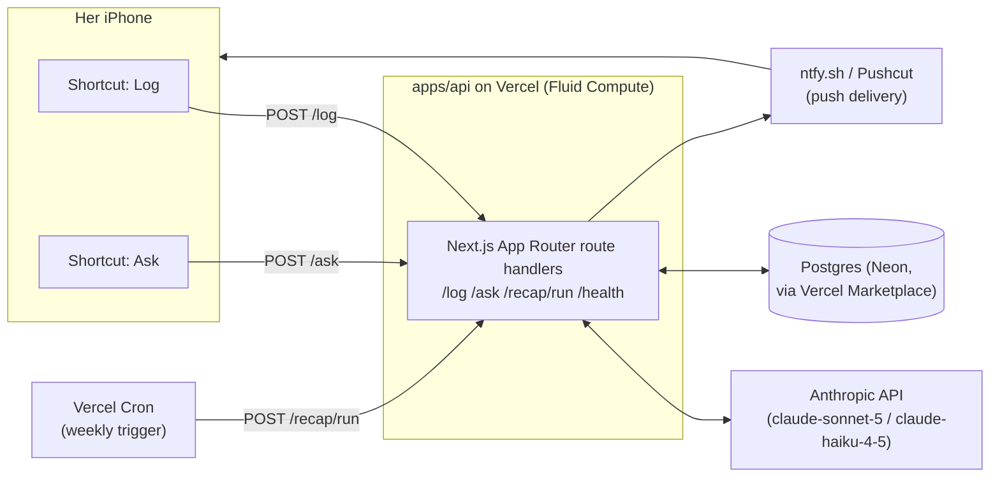

# Lumen — Architecture Spec v1

A private, voice-first memory-and-answer service for two people. She talks to Siri;
Siri talks to Lumen; Lumen remembers things and answers questions about them.
No app, no typing, no visible tech.

Status: draft for review. Author: you. Audience: future-you (and anyone you hand this to).

---

## 1. Product goals

**In scope (v1):**

- **Log**: she says a phrase to Siri, speaks a freeform sentence, Lumen stores it as a structured fact.
- **Ask**: she says a phrase to Siri, asks a freeform question, Siri speaks the answer back.
- **Recap**: a scheduled weekly summary pushed to her phone.

**Explicit non-goals (v1):**

- No UI/app for her — Shortcuts + Siri is the entire client surface.
- No multi-user/tenant support — this is a 2-person system (her + you as admin).
- No real-time sync, no offline mode — requires network, same as every Shortcuts automation she already runs.
- No fine-grained taxonomy management UI — categories are inferred by the LLM, editable later only by you via direct DB access.

**UX bar:** this has to feel indistinguishable from Siri actually understanding her. Concretely:
- End-to-end latency for "ask" ≤ ~3s before speech starts (voice interactions feel broken past that).
- Zero required syntax — "walked the dog at 8 and again at 5" and "spent 40 on food, ugh" must both just work.
- Failures must degrade gracefully — Siri should never read out a stack trace or JSON.

---

## 2. The two user-facing flows

### Flow A — Log

```
"Hey Siri, log it"
  → Shortcut: Dictate Text
  → Shortcut: Get Contents of URL (POST /log, body: {"text": "<dictated>"})
  → Shortcut: Speak Text (short confirmation Lumen returns, e.g. "Got it — logged a workout.")
```

Lumen's job server-side: take the raw sentence, classify + extract structured fields via
an LLM call, persist both the raw text and the structured record.

### Flow B — Ask

```
"Hey Siri, ask"
  → Shortcut: Dictate Text
  → Shortcut: Get Contents of URL (POST /ask, body: {"question": "<dictated>"})
  → Shortcut: Speak Text (Lumen's spoken-friendly answer)
```

Lumen's job server-side: interpret the question, pull the relevant slice of her history,
have the LLM reason over it, return a short spoken-style answer (not JSON, not a table —
a sentence a person would say out loud).

### Flow C — Weekly recap

A cron job runs Sunday evening, an LLM summarizes the week's entries, and the summary is
pushed to her phone (push notification via ntfy.sh, or an iMessage/Pushcut trigger). No
action needed from her; pure delivery.

### Why "Dictate Text" not "Ask for Input"

`Ask for Input` in Shortcuts pops a text field — mostly hands-free but still a tap-to-confirm
UI moment. `Dictate Text` after a Siri phrase is the closest thing to zero-friction voice
capture. Confirm this against however she actually triggers it (Siri phrase directly vs.
opening Shortcuts) once you build the real Shortcut — worth testing both.

---

## 3. High-level architecture



**Why Vercel + Neon instead of "run it on my Mac":**

The Mac + Tailscale setup from the earlier brainstorm is great for a weekend prototype,
but it fails the UX bar the moment your laptop is asleep, on a different network, or you're
traveling — and a broken "ask" from her perspective isn't "the server's down," it's "this
doesn't work." A managed always-on deployment removes an entire failure class for a
feature whose entire value proposition is reliability. Cost at this scale (two users,
sporadic requests) is effectively $0–5/mo.

Keep the Mac option in your back pocket only for local dev/iteration — not for what she
actually talks to.

---

## 4. Components → workspace mapping

| Component | Package | Notes |
|---|---|---|
| API routes | `apps/api` | Next.js App Router, route handlers only (`app/api/*/route.ts`) — no pages, no UI. Deployed as Vercel Functions (Fluid Compute, Node runtime). No Edge needed — the LLM call dominates latency, not routing. |
| Prompts, Zod schemas, category taxonomy | `packages/core` | Framework-free — importable by `apps/api` today, by a future `apps/web` admin view without duplication. |
| DB schema + client | `packages/db` | Drizzle ORM over the Neon serverless driver; schema, migrations, and a `createDb()` factory live here, not in `apps/api`. |
| Shared tsconfig/lint | `packages/config` | One base config every package/app extends. |
| Shortcuts (client) | *(not code — configured in the Shortcuts app, screenshots/exports optionally saved under `docs/`)* | |

### 4.1 API layer

- **Next.js App Router, not a bare Hono function.** The original plan used a single Hono
  app in a framework-less `api/index.ts` Vercel Function (leaner in principle, since v1 has
  no UI). In practice, bare `/api`-only Vercel Functions get far less real-world exercise
  locally than Next.js projects do — `vercel dev`'s zero-config Functions dev server proved
  unreliable in testing (requests to matched routes hung indefinitely, reproducible even
  with a trivial zero-dependency handler), whereas `next dev` is Vercel's most battle-tested
  local dev path. Each endpoint is a plain `route.ts` file (`app/api/log/route.ts`, etc.) —
  no pages, no React rendering, `next`/`react`/`react-dom` are dependencies only because the
  framework requires them, not because there's any UI.
- Auth: every request from a Shortcut carries a static bearer token in the `Authorization`
  header, provisioned as a Vercel env var and hardcoded into the two Shortcuts (Shortcuts
  supports setting request headers in "Get Contents of URL"). This is a 2-person private
  API — a shared secret is proportionate, not a JWT/OAuth flow.

### 4.2 LLM layer

- Access Claude **directly** via `@ai-sdk/anthropic` (AI SDK's Anthropic provider,
  not the Vercel AI Gateway) — calls go straight to `api.anthropic.com`, billed to
  your own Anthropic account, with no Vercel spend in the loop. Requires
  `ANTHROPIC_API_KEY` from console.anthropic.com — a Claude.ai Pro/Max chat
  subscription does **not** grant API credits, those are billed separately.
  Model IDs: `claude-sonnet-5` and `claude-haiku-4-5` (or Haiku for the
  cheap/fast extraction path — see §6).
- Two distinct LLM responsibilities, kept as separate prompts/tools rather than one
  do-everything call:
  1. **Extraction** (`/log`): freeform sentence → structured record.
  2. **Answering** (`/ask`): question + retrieved context → short spoken sentence.

### 4.3 Data layer

- Postgres via Neon (Vercel Marketplace integration — provisioning and env vars are
  automatic through `vercel integration add`).
- One core table (see §5). Skip a vector DB for v1 — at personal-journal scale (dozens of
  entries/week), a SQL `WHERE timestamp BETWEEN ... ` plus a keyword/category filter handily
  outperforms the complexity of embeddings. Revisit only if "ask" starts needing fuzzy
  semantic recall over months of history that date/category filters can't narrow down.

### 4.4 Scheduler + push

- Vercel Cron (declared in `apps/api/vercel.ts`) hits `/recap/run` every Sunday at a fixed time.
- Delivery: ntfy.sh is the simplest (free, no account friction, one HTTP POST, has an iOS
  app that shows a native notification). Pushcut is the upgrade if you want the recap
  notification itself to be tappable into a richer Shortcut-driven view later.

---

## 5. Data model

Defined in `packages/db/src/schema.ts` (Drizzle); SQL equivalent:

```sql
create table entries (
  id           bigint generated always as identity primary key,
  created_at   timestamptz not null default now(),
  occurred_at  timestamptz not null,        -- when the thing happened (may differ from created_at)
  raw_text     text not null,               -- exactly what she said
  category     text not null,               -- e.g. 'fitness', 'spending', 'mood', 'errand'
  summary      text not null,               -- short normalized restatement, for recap/ask context
  data         jsonb not null default '{}', -- category-specific structured fields
  source       text not null default 'shortcut'
);

create index entries_occurred_at_idx on entries (occurred_at desc);
create index entries_category_idx on entries (category);
```

`data` is intentionally a schemaless bag (e.g. `{"amount": 40, "currency": "USD"}` for
spending, `{"activity": "walk", "count": 2}` for fitness) — the category taxonomy will
drift as you see real usage, and jsonb absorbs that without migrations.

Retiring the `category` enum idea in favor of a free-text category set by the LLM,
constrained via prompt to a short known list (see §6.1) plus an `"other"` escape hatch,
avoids a rigid schema fighting the fact that "her life" doesn't fit clean columns.

---

## 6. LLM prompt design

Schemas below live in `packages/core/src/schemas.ts`, shared by every caller in `apps/api`.

### 6.0 Language

She speaks Dutch; you don't assume she'll type. Every prompt in this section carries one
standing instruction: **detect the language of the input and reply in that same language**
— don't hardcode Dutch, since she may mix in English and the same system should work for
you too. This is a prompt-level instruction only; nothing else in the architecture changes:

- Claude is multilingual — extraction quality and answer quality in Dutch is not materially
  different from English, no separate pipeline or model needed.
- `category` values (`fitness`, `spending`, …) stay fixed English enum keys regardless of
  input language — they're internal, never shown to her. Only `summary`, `confirmation`,
  and `answer` (the strings a human actually reads/hears) need to match her language.
- Dictation and playback are a device concern, not an API concern: `Dictate Text` and
  `Speak Text` in Shortcuts follow the iPhone's Siri/dictation language setting. As long as
  her phone dictates in Dutch, the text Lumen receives is already Dutch — verify once the
  real Shortcut exists that `Speak Text` also picks a Dutch voice for the reply.

### 6.1 Extraction (`POST /log`)

Force structured output via the AI SDK's `generateObject` (Zod schema), not free-text
parsing:

```ts
const ExtractionSchema = z.object({
  occurred_at: z.string().datetime(),   // resolved relative to request time + her timezone
  category: z.enum(["fitness", "spending", "mood", "food", "errand", "work", "other"]),
  summary: z.string(),                  // one normalized sentence
  data: z.record(z.any()),              // category-specific fields, model's discretion
  confirmation: z.string(),             // short spoken-back confirmation, e.g. "Logged a walk at 8am."
});
```

Pass current timestamp + her IANA timezone (`Europe/Amsterdam` — §10) in the prompt so
"at 8 and again at 5" resolves to real timestamps rather than the LLM guessing today vs.
some other day. `summary` and `confirmation` must be written in the same language as the
dictated input (§6.0) — a Dutch sentence in, a Dutch confirmation out.

Model choice: this is a cheap, low-ambiguity task — `claude-haiku-4-5` is enough and keeps
latency and cost down. Reserve Sonnet for `/ask`, where reasoning quality matters more.

### 6.2 Answering (`POST /ask`)

Two-step, not one giant prompt:

1. **Scope the query.** A small model call (or even a plain heuristic first) turns the
   question into a date range + optional category filter — "how many times did I go to the
   gym this month" → `{category: "fitness", from: <1st of month>, to: <now>}`.
2. **Answer over the retrieved rows.** Fetch matching `entries`, feed them + the original
   question to Claude, and constrain the output to a single spoken sentence:

```ts
const AnswerSchema = z.object({
  answer: z.string(),   // what Siri will literally speak — no markdown, no lists
});
```

If the retrieved set is empty, the model should say so plainly ("I don't have anything
logged for that") rather than hallucinating — worth an explicit instruction and a quick
eval pass once you have a few weeks of real data. `answer` follows the same language rule
as extraction (§6.0): reply in the language the question was asked in, regardless of which
language the underlying `entries` rows were stored in.

### 6.3 Recap (`POST /recap/run`, cron-triggered)

Pull the last 7 days of `entries`, one Claude call producing a short warm paragraph
(2–4 sentences, not a bullet dump — this is meant to read like a note, not a report). Unlike
`/log` and `/ask`, there's no per-request input to detect a language from — write the recap
in whichever language she predominantly logs in that week, or just fix it to Dutch outright
once §10's open decisions are settled.

---

## 7. API contract

All endpoints require `Authorization: Bearer <SHARED_TOKEN>`.

| Method | Path          | Body                    | Response                              |
|--------|---------------|--------------------------|----------------------------------------|
| POST   | `/log`        | `{ "text": string }`      | `{ "confirmation": string }`           |
| POST   | `/ask`        | `{ "question": string }`  | `{ "answer": string }`                 |
| POST   | `/recap/run`  | *(none, cron only)*       | `{ "ok": true }`                       |
| GET    | `/health`     | —                         | `{ "ok": true }`                       |

Error responses still return `200` with a spoken-safe fallback string in the same shape
(`confirmation`/`answer`) rather than a raw 4xx/5xx — the Shortcut has no error-handling UX,
so the contract's job is to make sure Siri always has *something* sane to say. Log the real
error server-side (Vercel's log drain is enough at this scale) for you to debug later.

---

## 8. Security & privacy

- Single shared bearer token, rotated by you if it ever leaks (Shortcuts stores the header
  value in the shortcut definition — treat it like a password, don't screenshot/share it).
- HTTPS is automatic (Vercel default).
- No third-party data sharing beyond Anthropic (called directly, no Gateway in between)
  for the LLM calls — everything she says passes through your API and their model,
  nowhere else.
- Backups: Neon has point-in-time recovery on by default; no extra work needed, but worth
  confirming the plan tier before you rely on it.
- This is emotionally sensitive data (moods, spending, personal notes) — treat the DB and
  env vars with the same care you'd want for your own journal, not as a throwaway side project.

---

## 9. Phased build plan

**Phase 0 — skeleton (½ day)**
`/health`, `/log`, `/ask` with the extraction/answer schemas above, Neon table (`pnpm --filter @lumen/db db:generate && db:migrate`), deployed to a Vercel preview. Test with `curl`, not Shortcuts yet.

**Phase 1 — the two Shortcuts (½ day)**
Build "Log" and "Ask" in the Shortcuts app pointing at the preview URL, add Siri phrases,
test end-to-end from her phone (use your own account first).

**Phase 2 — recap (few hours)**
`/recap/run`, Vercel Cron entry in `apps/api/vercel.ts`, ntfy topic + her ntfy app subscription.

**Phase 3 — polish**
Tune prompts against real usage patterns (categories will need adjusting once you see what
she actually logs), tighten the empty-result and ambiguous-date edge cases in `/ask`.

**Phase 4 — nice-to-haves (optional, later)**
Couple-linked triggers, photo-of-the-day, `/days-together`-style novelty endpoints from the
original brainstorm, and possibly a private `apps/web` admin dashboard to browse/edit entries —
additive once the core loop is trustworthy, not before.

---

## 10. Decisions (resolved — 2026-07-19)

1. **Project/product name** — Lumen. Settled.
2. **Her timezone** — Netherlands, IANA `Europe/Amsterdam`. Use the IANA name everywhere
   (extraction prompt, cron math), not a fixed `+2` offset — the Netherlands observes DST
   (CET/UTC+1 in winter, CEST/UTC+2 in summer), so a hardcoded offset would silently drift
   an hour twice a year. `Intl.DateTimeFormat`/`date-fns-tz` resolve this correctly from the
   zone name; the LLM prompt should still be given the *current* resolved offset alongside
   the zone name so "at 8" resolves against the right instant.
3. **Push channel** — ntfy.sh. Settled for v1; Pushcut remains a documented upgrade path (§4.4)
   if remote shortcut-triggering becomes wanted later, not a blocker now.
4. **Initial category set** — ship the six-category guess in `packages/core/src/schemas.ts`
   (`fitness`, `spending`, `mood`, `food`, `errand`, `work`, `other`) as-is. Explicitly
   deferred: revisit once Phase 0/1 are running and there's real usage to look at, per §9
   Phase 3. Don't tune this before there's data.
5. **Recap day/time** — Sunday evening. Cron runs on a fixed UTC schedule (Vercel Cron has
   no DST-aware scheduling), so pick a UTC time that lands in "evening" Amsterdam time either
   way: `0 18 * * 0` (18:00 UTC) → 19:00 local in winter (CET), 20:00 local in summer (CEST).
   Both read as evening; the hour of drift across the DST transition is an accepted tradeoff,
   not a bug to solve. See `apps/api/vercel.ts`.
